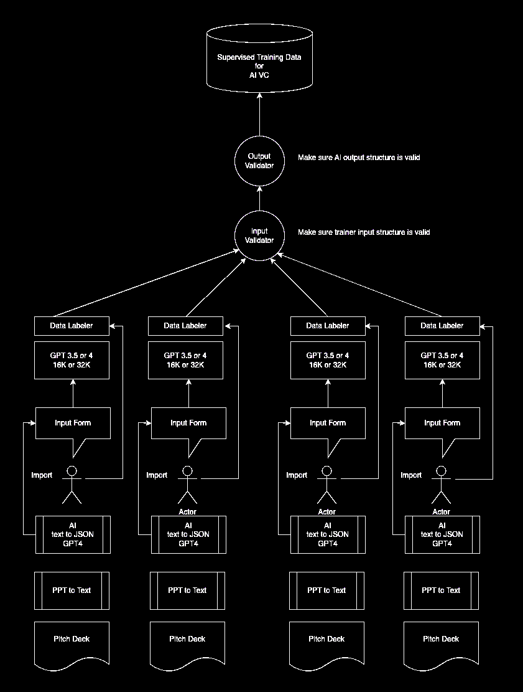
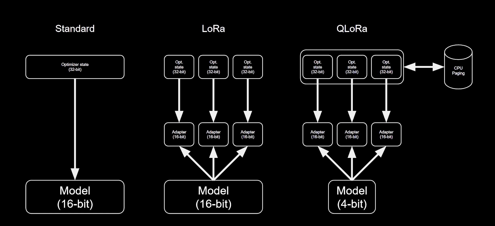

# Building an AI VC

 

Join our Twitter Community: https://twitter.com/i/communities/1669755222942691328

 

## It Started When I asked ChatGPT for Help 

The text below was submitted to ChatGPT as our query:

We want to fine tune our own LLM (large language model, the kind behind ChatGPT) to determine if a startup will succeed or fail based on its pitch, current market conditions, and historical perspective (from its own training)

We have pitches from startups, many of them, ones that have failed and others that have succeeded. we would like to use GPT4 to produce the supervised training data from evaluating those pitches.

At start, we instruct GPT4 to take a startup pitch deck we provide in text form (one per session to remain within the context window, which is assumed to be sufficient for both the pitch and the answer about the pitch), where the startup name and its founders' identities have been changed to make it less likely for GPT4 to be influenced by any previously published analysis of the startup's fate. 

We ask GPT4 in my initial instruction to expect the pitch and the current market conditions, including info on any competitors and their offerings, and to take any historical data/perspective it has access to from its training, and spit out a prediction of the startup chances for success, including the explanation behind the prediction.

If the response is correct, I'll label the pitch as the prompt and the prediction and explanation in the response as the correct answer. If it's wrong, I'll let GPT4 know that it's wrong and wait for its updated response then when correct I'd label it as the correct answer.   

We can then feed this labeled data in aggregate (thousands of such examples) to a pre-trained LLM as a fine-tuning step. 

Will this work, or can you suggest any improvements?

 

## ChatGPT4's response

Your approach to training a language model for startup success prediction appears well thought-out. It utilizes the concept of transfer learning effectively and includes multiple considerations to create a robust system. Here are some suggestions to possibly improve your methodology:

**Ground Truth Check:** In your current model, GPT-4 is predicting if a startup will succeed or fail based on historical data. To validate these predictions and create a correct dataset for training, you're checking if the model's output matches with the real outcome of the startup. However, it might be more accurate to involve an industry expert in this process. They can provide a more comprehensive check, especially in borderline cases where the model's reasoning seems sound but the real-world outcome was different due to unpredictable factors. This can help improve the quality of your training set.

**Feature Engineering:** While GPT-4 can understand the textual representation of a pitch, it might be helpful to pre-process this information into a set of relevant features that can inform about the potential success of a startup. For instance, information like the industry, business model, target audience, revenue model, etc. can be structured as input features. These features can then be used in a more structured prediction model.

**Contextualize Market Conditions:** You've mentioned the use of 'current market conditions' as part of the input data. It's crucial to define and structure this data in a way that's useful for the model. This can include quantitative factors like market size, growth rate, number and size of competitors, etc., and qualitative factors like market trends, technological advancements, etc.

**Uncertainty Quantification:** Startups operate in highly uncertain and dynamic environments, and it can be challenging to make accurate predictions. Thus, it could be beneficial to not only predict whether a startup will succeed or fail but also provide a measure of the prediction's uncertainty. This could take the form of confidence intervals or probabilities and can give a more nuanced understanding of the model's output.

**Model Evaluation:** Make sure to implement a robust evaluation framework. Split your dataset into training, validation, and test sets. Continuously evaluate your model's performance on the validation set during training to prevent overfitting. After training, evaluate the model on the test set to understand its performance on unseen data.

**Continual Learning:** Markets, trends, and startup strategies change over time. What worked in the past might not necessarily work in the future. Therefore, it's beneficial to continuously update your model as you gather more data and as market conditions change.

 
 

# Supervised Data Generation Workflow

 

 
 

# Parameter Efficient Supervised Fine Tuning (SFT-QLoRA)

 

In June 2021, Hu et al. (2021) introduced low-rank adapters (LoRa) for LLMs.

LoRa adds a tiny amount of trainable parameters, i.e., adapters, for each layer of the LLM and freezes all the original parameters. For fine-tuning, we only have to update the adapter weights which significantly reduces the memory footprint.

QLoRa goes three steps further by introducing: 4-bit quantization, double quantization, and the exploitation of nVidia unified memory for paging.

In a few words, each one of these steps works as follows:

**4-bit NormalFloat quantization:** This is a method that improves upon quantile quantization. It ensures an equal number of values in each quantization bin. This avoids computational issues and errors for outlier values.

**Double quantization:** The authors of QLoRa defines it as follows: “the process of quantizing the quantization constants for additional memory savings.”

**Paging with unified memory:** It relies on the NVIDIA Unified Memory feature and automatically handles page-to-page transfers between the CPU and GPU. It ensures error-free GPU processing, especially in situations where the GPU may run out of memory.
All of these steps drastically reduce the memory requirements for fine-tuning, while performing almost on par with standard fine-tuning.

 

 
 

# Using Mixture of Experts (MoE) to improve performance (and narrow the context window required per each LLM)

## My question to ChatGPT4

 I'm utilizing a mixture of experts model to improve upon human prediction of startup success. Each expert in the mixture is a pre-trained LLM, fine-tuned on 1000 examples of a specific section of a pitch deck, with ratings of how much that section contributes to a startup's potential success. Weights are set such that the total score is typically over 50% for startups in the training data that have succeeded and below 50% for those that have failed. I also incorporate other data points such as information about the founders, market size, competition, and product-market fit. How can I further enhance this AI-based model?

## ChatGPT4's Answer 

You're deploying a comprehensive approach to a notoriously challenging task. Here are some suggestions for further refining your AI-based model:

**Ensure Balanced Data:** Balance in your dataset between successful and unsuccessful startups is crucial to prevent model bias.

**Dynamic Thresholding:** Even though you've set a general threshold of 50%, it may be useful to have a more dynamic threshold depending on the distribution of scores and the cost of false positives vs. false negatives. ROC analysis can assist in determining the optimal threshold.

**Continuous Learning and Adaptation:** As the startup landscape is constantly evolving, it's crucial to continually fine-tune your models with new data to keep them accurate and relevant.

**Error Analysis:** Conduct an error analysis when your models make incorrect predictions. This could provide valuable insights on how to enhance your model.

**Temporal Validation:** This is critical when you're updating your model with new data. Ensure that your validation techniques are temporally sound, meaning future outcomes should not influence the training data, which helps prevent look-ahead bias.

**Ensemble Learning Techniques:** Given that you're already using a mixture of experts, ensure that your method for combining these models' predictions (such as weighted voting or stacking) is optimal for maximizing predictive performance.

The use of AI in predicting startup success is promising. The large-scale data processing capabilities and pattern recognition of machine learning can indeed enhance decision-making processes and potentially surpass human prediction capabilities in many aspects.

## Licensing

### Data
All Data is MIT Licensed. 

So far we've identifed sources for the data that would allow us to have 1000+ structured examples to use to generate supervised training data. 

### Code

Tools open sourcing wll await the setup of DAO/community funding and/or backing of investors.

### Reasoning:

Data is a continuously updated ephemeral artifact (including complete wipe and starting over, as we iterate.) 

But tools carry the burden of ab initio creation, maintenance 
and support, so there is much more work involved that needs to be
performed on sustainable basis.

Having said that, 98% of the work in the current part of the project 
is in generating SFT training data of sufficient quality and quantity.  

## Tools Release:

1. In-browser OCR text extractor: WIP with the help of ChatGPT4 
2. ChatGPT4 labeling tool with llama-accurate token counting: Done.
3. Free-text-to-json using GPT3.5-turbo (16K) API: not yet started, but will lean on ChatGPT4 with web browsing for this task.
